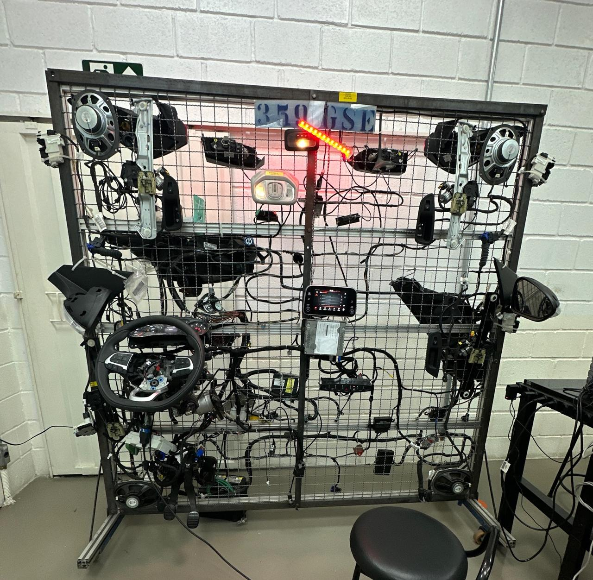
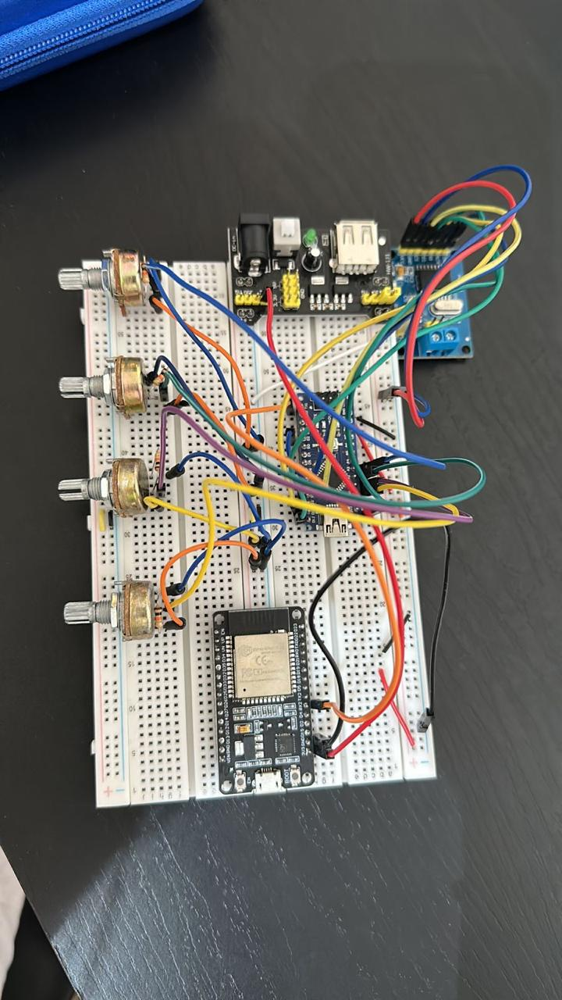
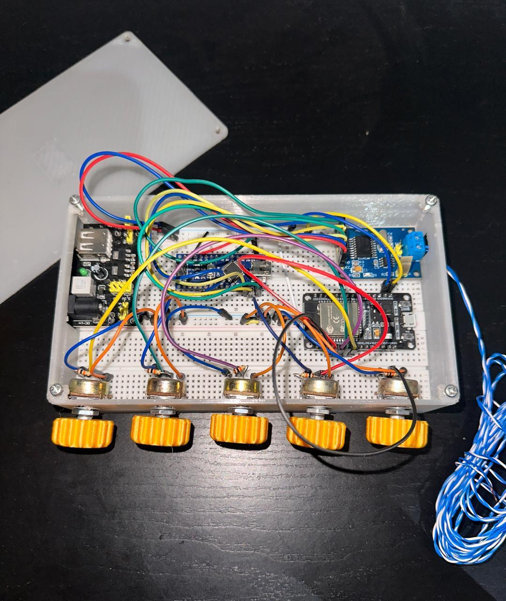
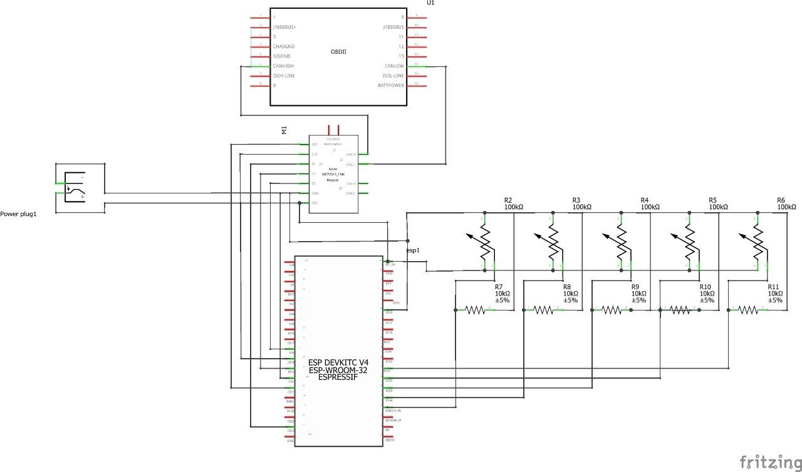
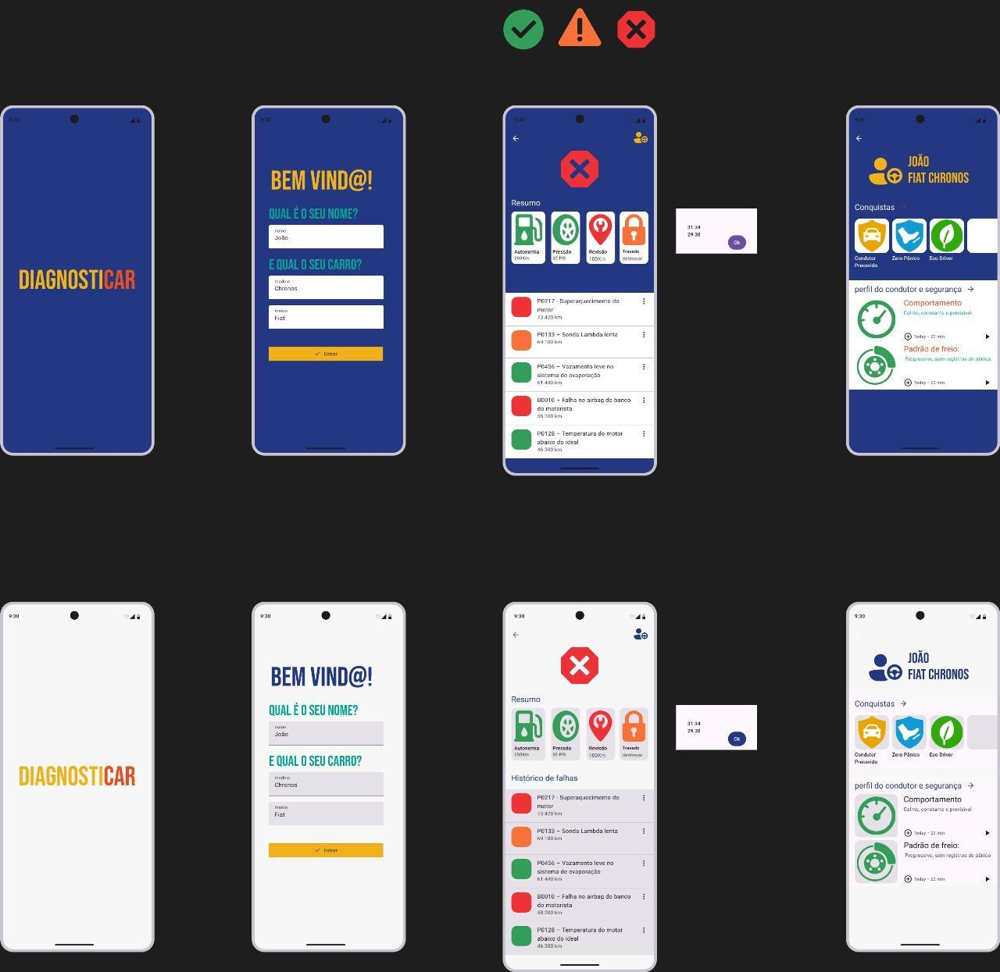

#  Monitoramento Veicular IoT com CAN Bus, ESP32 e React Native

**PUC MINAS | Projeto de Redes Veiculares**  
**Integrantes:** 

---

##  Visão Geral

Este projeto implementa um ecossistema de telemetria veicular utilizando o protocolo **CAN (Controller Area Network)**. O sistema captura dados de uma arquitetura elétrica real, processa via hardware híbrido (Arduino + ESP32) e disponibiliza as informações em nuvem (MQTT) para visualização em um aplicativo mobile.

---

##  Arquitetura do Sistema

O projeto foi estruturado em quatro camadas principais:

1.  **Aquisição (Hardware Automotivo):** Um **Arduino Nano** integrado ao controlador **MCP2515** realiza a leitura dos PIDs via porta **OBD-II**.
2.  **Simulação de Sensores:** 5 potenciômetros foram acoplados para simular o sistema **TPMS (Tyre Pressure Monitoring System)**, enviando dados de PSI de cada pneu.
3.  **Gateway IoT:** Uma **ESP32** recebe os dados do Arduino e atua como ponte para a nuvem via protocolo **MQTT**.
4.  **Interface Mobile:** Aplicativo em **React Native** que consome os tópicos MQTT para exibição em tempo real.

---

## Ambiente de Testes 

A validação do projeto ocorreu na bancada de arquitetura eletroeletrônica (conhecida como **Plywood**) do **Fiat Argo**. 

> ###  Agradecimentos
> Agradecemos à **Stellantis** pela doação deste equipamento ao laboratório de engenharia da **PUC Minas**. A utilização de um chicote elétrico e módulos (ECUs) originais foi fundamental para a análise real do comportamento do barramento CAN e sucesso deste projeto.

---

##  Hardware e Interface

###  Esquema do Protótipo

---

##  Aplicativo e Design

O aplicativo Android foi desenvolvido para oferecer uma experiência de diagnose automotiva, focando em baixa latência na atualização dos dados.

###  WInterface

